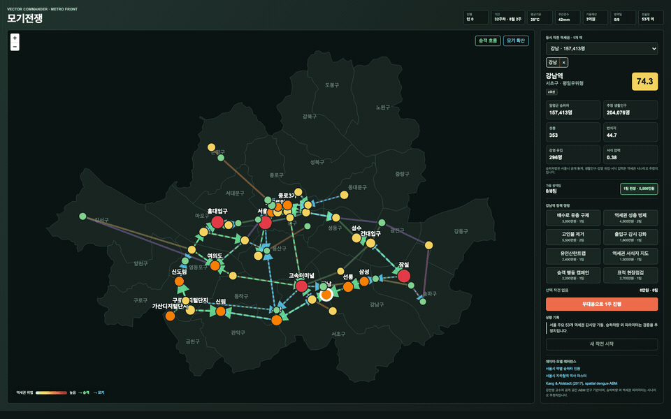

# Vector Commander

강전영 교수의 공개 공간 명시적 모기·감염병 ABM 연구를 기반으로 설계한
GIS 전략 게임 프로토타입입니다. 서울 25개 자치구에 방역 자원을 배치하고,
1주 단위 공간 시뮬레이션으로 모기 개체군과 감염 위험 변화를 관찰합니다.

지역 선택, 정책 편성, 예산과 방역팀 배분, 주간 시뮬레이션, 자치구 간
모기 및 생활인구 이동 시각화를 하나의 턴제 흐름으로 구성했습니다.

> 모델 구조는 강전영 교수의 공개 논문을 기반으로 하지만, 논문의 원본
> 코드와 원본 파라미터를 직접 이식한 재현판은 아닙니다. 현재 계산은
> 투명한 샘플 어댑터이며 운영 또는 방역 의사결정에 사용하면 안 됩니다.

## 데모

방역팀 편성, 복수 자치구 선택, 구별 정책 배정, 1주 진행과 모기·생활인구
이동 경로 갱신까지의 실제 실행 화면입니다.

## 주요 기능

- 서울 25개 자치구 GeoJSON 경계와 위험도 지도
- 여러 자치구를 한 턴에 선택하는 동시 작전
- 자치구별로 서로 다른 방역 정책 배정
- 예산 기반 방역팀 편성과 자원 제약
- 정책 없이도 진행되는 1주 단위 턴
- 온도, 강수, 번식지, 유충, 성충, 감염 벡터를 반영한 주간 계산
- 자치구 간 모기 확산 경로와 추정 생활인구 이동 경로
- 등록인구, 추정 생활인구, 감염 위험 지표
- 교체 가능한 SimulationAdapter 인터페이스
- Docker, Docker Compose, Apple Container 실행 지원

## 기술 구성

| 영역 | 기술 |
| --- | --- |
| Web | Next.js 16, React 19, TypeScript |
| GIS | MapLibre GL, GeoJSON, SVG overlay |
| API | FastAPI, Pydantic |
| Simulation | Python spatial ABM-style sample adapter |
| Packaging | Docker, Docker Compose, Apple Container |
| Tests | pytest, ESLint, Next.js production build |

## 아키텍처

    Browser
      |
      +-- Next.js command UI
      |     +-- Seoul risk map
      |     +-- district operation plans
      |     +-- movement layers
      |
      +-- FastAPI game API
            +-- Game Layer
            |     +-- budget and team rules
            |     +-- multi-district commands
            |     +-- weekly turns
            |
            +-- Simulation Core
                  +-- SimulationAdapter
                  +-- SampleMosquitoAdapter
                  +-- district state transitions

게임 규칙은 backend/app/simulation/game.py에, 모델 계산은
backend/app/simulation/adapters.py에 분리되어 있습니다. 검증된 외부
모델을 연결할 때는 SimulationAdapter를 구현하면 API와 프론트엔드를
유지할 수 있습니다.

## 빠른 실행

8080 포트는 사용하지 않습니다.

### Docker Compose

    docker compose up --build

### 단일 Docker 이미지

    docker build -t vector-commander:local .
    docker run --rm --name vector-commander \
      -p 127.0.0.1:3000:3000 \
      -p 127.0.0.1:8000:8000 \
      vector-commander:local

### Apple Container

    ./scripts/build-apple-container.sh
    container run --rm --name vector-commander \
      -p 127.0.0.1:3000:3000 \
      -p 127.0.0.1:8000:8000 \
      vector-commander:local

실행 후 다음 주소를 사용합니다.

- Game: http://127.0.0.1:3000
- API: http://127.0.0.1:8000
- OpenAPI: http://127.0.0.1:8000/docs

## 로컬 개발

### Backend

    cd backend
    python3 -m venv .venv
    source .venv/bin/activate
    pip install -r requirements.txt
    uvicorn app.main:app --reload --port 8000

### Frontend

    cd frontend
    cp .env.example .env.local
    npm ci
    npm run dev

## 검증

    cd backend
    .venv/bin/python -m pytest -q

    cd ../frontend
    npm run lint
    npm run build

GitHub Actions에서도 백엔드와 프론트엔드 검증을 각각 실행합니다.

## 게임 흐름

1. 예산으로 필요한 방역팀을 편성합니다.
2. 지도에서 하나 이상의 자치구를 작전 구역으로 추가합니다.
3. 각 자치구에 정책 조합을 별도로 배정합니다.
4. 총예산과 총 방역팀 소요량을 확인합니다.
5. 동시 작전을 실행하거나 무대응으로 1주를 진행합니다.
6. 갱신된 개체수, 번식지, 감염 위험과 이동 경로를 비교합니다.

지원 정책은 유충 구제, 성충 방제, 번식지 제거, 감시 강화,
유인산란트랩, 서식지 정밀지도, 주민 행동 캠페인, 표적 현장점검입니다.

## 모델 투명성

SampleMosquitoAdapter는 강전영 교수의 공개 연구에서 기술된 공간 ABM
구조를 기반으로 재구성한, 소프트웨어와 게임플레이 검증용 샘플 모델입니다.

- 온도와 강수에 따른 번식 압력
- 유충 성장과 자연 사망
- 성충 우화와 자연 사망
- 인접 자치구 간 확산
- 지역별 수계, 인구, 열섬 지수
- 정책별 번식지, 유충, 성충, 감염 비율 감소 효과

shared/config/sample_scenario.json의 비용과 생태 파라미터는 예시값입니다.
추정 생활인구와 이동량도 실시간 통신사 또는 서울시 OD 자료가 아닌
시나리오 계산값입니다.

## 연구 참고문헌

- Kang, J.-Y. and Aldstadt, J. (2017).
  [The influence of spatial configuration of residential area and vector populations on dengue incidence patterns in an individual-level transmission model](https://doi.org/10.3390/ijerph14070792).
  International Journal of Environmental Research and Public Health, 14(7), 792.
- Kang, J.-Y. and Aldstadt, J. (2019).
  [Using multiple scale space-time patterns in variance-based global sensitivity analysis for spatially explicit agent-based models](https://doi.org/10.1016/j.compenvurbsys.2019.02.006).
  Computers, Environment and Urban Systems, 75, 170-183.

## 데이터 출처

서울 자치구 경계는 KOSTAT 2013 자료를 배포하는
[southkorea/seoul-maps](https://github.com/southkorea/seoul-maps)의
단순화 GeoJSON을 기반으로 합니다. 해당 데이터는 Apache License 2.0을
따릅니다. 자세한 내용은 backend/data/seoul/README.md와
THIRD_PARTY_NOTICES.md를 확인하세요.

등록인구는 게임 시나리오용 반올림 스냅샷이며 최신 행정 통계로 간주하면
안 됩니다.

## 디렉터리

    backend/
      app/api/             FastAPI routes
      app/simulation/      game layer, schemas, adapters
      data/seoul/          district boundary data and attribution
      tests/               API and simulation tests
    frontend/
      src/app/             Next.js application
      src/components/      map and command panel
      src/lib/             API client and shared types
    shared/config/         sample scenario
    scripts/               container entry and Apple build helper

## 라이선스

프로젝트에서 직접 작성한 코드는 MIT License로 배포합니다. 포함된 서울
경계 데이터는 Apache License 2.0을 따릅니다. 자세한 제3자 고지는
THIRD_PARTY_NOTICES.md를 확인하세요.
